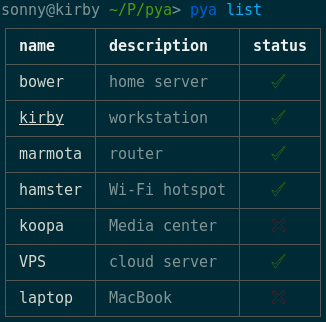

pya
===

[](https://travis-ci.org/sonnyp/pya/branches)
[](http://standardjs.com/)

terminal/CLI application to manage devices power state



`pya` uses Wake-On-Lan and SSH so there's nothing to install on the devices.

## Install

`npm install -g pya`

## Usage

```
➜  ~  pya help

  terminal/CLI application to manage devices power state

  Usage
    $ pya <action> <device>

  Options
    -h, --help print this help
    -v, --version print version

  Examples
    $ pya help # print this help
    $ pya list # list devices (default)
    $ pya sleep <device> # put device to sleep
    $ pya wake <device> # wake device up
    $ pya ping <device> # ping device
    $ pya poweroff <device> # shutdown the device
    $ pya reboot <device> # reboot the device
    $ pya exec <device> exec # exec command on device
    $ pya waitup <device> # wait for the device to be available
    $ pya waitdown <device> # wait for device to be unavailable
    $ pya show <device> # show listing for device
    $ pya version # print pya version
```

## Test

```
npm install -g standard
npm test
```
